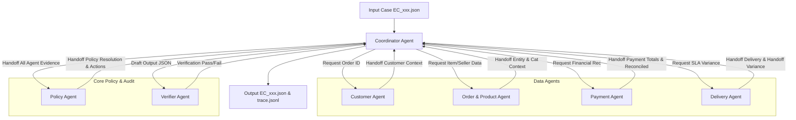

# Multi-Agent E-commerce Dispute Resolution Architecture

## 1. System Overview

Hệ thống Multi-Agent được thiết kế theo kiến trúc **Agent-to-Agent (A2A) Handoff Framework** để tự động điều tra, đối soát và xử lý các khiếu nại thương mại điện tử trên bộ dữ liệu Olist E-commerce Public Dataset theo chính sách `EC_POLICY_V2`.

---

## 2. Agent Roles & Responsibilities

| Agent Name | Primary Responsibility | Input Contract | Output / Handoff Payload |
| :--- | :--- | :--- | :--- |
| **Coordinator Agent** | Tiếp nhận case request, điều phối luồng handoff giữa các agent, ghi nhận log `trace.jsonl` và xuất kết quả `output/EC_xxx.json`. | Case input (`EC_xxx.json`) | Validated output JSON, execution trace logs |
| **Customer Agent** | Truy vết danh tính khách hàng, liên kết `customer_id` với `customer_unique_id` và xác định lịch sử mua hàng. | `order_id` | `customer_unique_id`, `related_order_ids`, `repeat_customer` flag |
| **Order & Product Agent** | Trích xuất thông tin đơn hàng, danh sách item, mã seller, mã sản phẩm và phân loại ngành hàng. | `order_id` | `item_ids`, `seller_ids`, `product_ids`, `category_names`, `multi_item_order`, `multi_seller_order`, `multiple_categories` |
| **Payment Agent** | Tổng hợp các dòng thanh toán (`order_payments`), tính toán tổng giá trị đơn (`price + freight`) và đối soát sai số. | `order_id`, item records | `payment_ids`, `payment_types`, `item_total_brl`, `freight_total_brl`, `expected_total_brl`, `payment_total_brl`, `difference_brl`, `reconciled`, `split_payment` |
| **Delivery Agent** | Phân tích mốc thời gian giao hàng, tính toán chênh lệch giờ so với cam kết (`delivery_variance_hours`) và kiểm tra seller bàn giao carrier (`late_handoff`). | `order_id`, item records, seller IDs | `delivered_at`, `estimated_delivery_at`, `carrier_handoff_at`, `delivery_variance_hours`, `seller_handoff_analysis`, `late_handoff_seller_ids` |
| **Policy Agent** | Áp dụng chính sách `EC_POLICY_V2` theo đúng thứ tự ưu tiên, xác định `primary_issue`, `secondary_issues`, `root_cause`, refund và resolution actions. | Handoff payloads từ các agent | `primary_issue`, `cause_code`, `resp_parties`, `refund`, `case_status`, `secondary_issues`, `actions`, `evidence_ids` |
| **Verifier Agent** | Kiểm tra toàn vẹn dữ liệu, định dạng ID, giới hạn độ dài mảng (array limits), kiểu dữ liệu và ràng buộc `confidence`. | Final draft JSON | Validation status (`True`/`False`), error diagnostics |

---

## 3. Data Access Matrix

Mỗi agent chỉ được phép đọc các bảng dữ liệu liên quan đến domain trách nhiệm của mình nhằm đảm bảo tính đóng gói (encapsulation) và bảo mật dữ liệu:

| Bảng Dữ Liệu | Customer Agent | Order & Product Agent | Payment Agent | Delivery Agent | Policy Agent | Verifier Agent |
| :--- | :---: | :---: | :---: | :---: | :---: | :---: |
| `olist_orders_dataset.csv` | Read | Read | - | Read | - | - |
| `olist_customers_dataset.csv` | Read | - | - | - | - | - |
| `olist_order_items_dataset.csv` | - | Read | Read | Read | - | - |
| `olist_order_payments_dataset.csv` | - | - | Read | - | - | - |
| `olist_products_dataset.csv` | - | Read | - | - | - | - |
| `olist_sellers_dataset.csv` | - | Read | - | - | - | - |

---

## 4. Sequential Handoff Flow & Business Contract

1. **Step 1 (Ingestion)**: `CoordinatorAgent` đọc `input/EC_xxx.json` và trích xuất `claimed_order_id`.
2. **Step 2 (Customer Intelligence)**: `CoordinatorAgent` gọi `CustomerAgent.analyze(claimed_order_id)`. `CustomerAgent` trả về thông tin danh tính và các đơn hàng khác của cùng `customer_unique_id`.
3. **Step 3 (Order & Product Analysis)**: `CoordinatorAgent` gọi `OrderProductAgent.analyze(claimed_order_id)`. `OrderProductAgent` trả về danh sách item, seller, product và category.
4. **Step 4 (Financial Reconciliation)**: `CoordinatorAgent` gọi `PaymentAgent.analyze(claimed_order_id, item_list)`. `PaymentAgent` tính toán các khoản thanh toán, doanh số hàng + cước và kiểm tra điều kiện `abs(difference) <= 0.10 BRL`.
5. **Step 5 (Logistics & SLA Check)**: `CoordinatorAgent` gọi `DeliveryAgent.analyze(claimed_order_id, item_list, seller_ids)`. `DeliveryAgent` tính toán sai số thời gian giao hàng và xác định seller bàn giao muộn cho carrier.
6. **Step 6 (Policy Resolution)**: `CoordinatorAgent` chuyển toàn bộ bằng chứng cho `PolicyAgent.analyze(...)`. `PolicyAgent` đối chiếu `EC_POLICY_V2` theo thứ tự ưu tiên 1 -> 6, xác định nguyên nhân gốc, các vấn đề phụ, giá trị hoàn tiền và các hành động xử lý tiếp theo.
7. **Step 7 (Audit & Quality Assurance)**: `CoordinatorAgent` chuyển bản thảo JSON cho `VerifierAgent.verify(final_output)`. `VerifierAgent` thực thi các kiểm tra hard boundary (array limits, null handling, ID schemas).
8. **Step 8 (Logging & Persistence)**: `CoordinatorAgent` lưu toàn bộ nhật ký trao đổi agent vào `trace.jsonl` và ghi kết quả đã kiểm định vào `output/EC_xxx.json`.

---

## 5. Evidence Standards & Traceability

Mọi bằng chứng thu thập bởi hệ thống multi-agent đều tuân theo chuẩn định dạng nghiêm ngặt:
- `order:<order_id>`
- `item:<order_id>:<order_item_id>`
- `payment:<order_id>:<payment_sequential>`
- `seller:<seller_id>`
- `policy:<root_cause_code>`

Các sự kiện không tồn tại trong dữ liệu thực tế sẽ bị loại bỏ hoàn toàn để phòng ngừa false positives.
